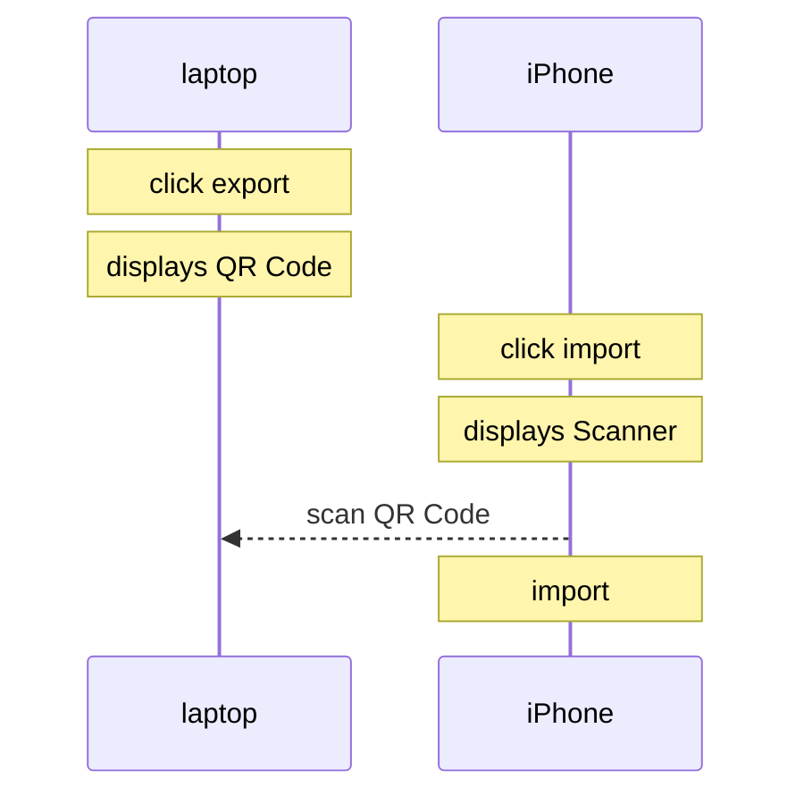
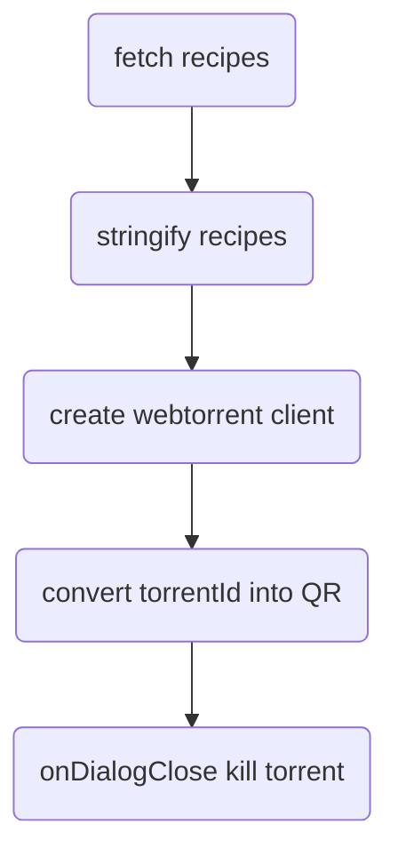
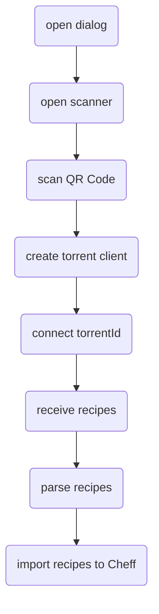

# Sync Data

> Transfer data peer-to-peer from one device to another.

As a user I would like to use the same recipes in my laptop and smartphone to avoid having to type them twice.

#### Exporting

#### Importing

